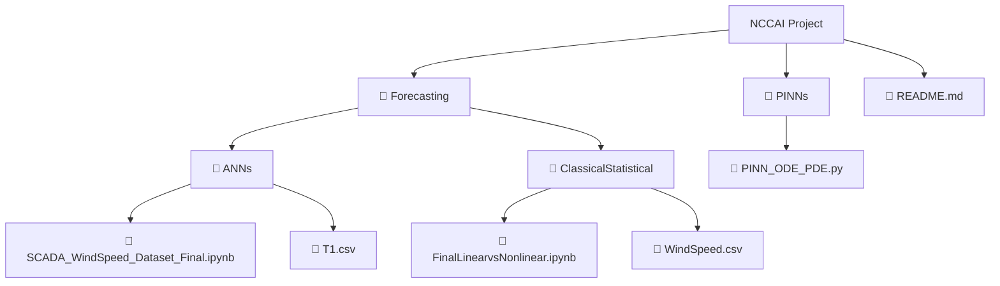

# NCCAI Repository Sitemap

This sitemap is generated automatically from the current GitHub repository structure.

```mermaid
flowchart TD
    N1["NCCAI Project"]
    N2["📁 Forecasting"]
    N1 --> N2
    N3["📁 ANNs"]
    N2 --> N3
    N4["📄 SCADA_WindSpeed_Dataset_Final.ipynb"]
    N3 --> N4
    N5["📄 T1.csv"]
    N3 --> N5
    N6["📁 ClassicalStatistical"]
    N2 --> N6
    N7["📄 FinalLinearvsNonlinear.ipynb"]
    N6 --> N7
    N8["📄 WindSpeed.csv"]
    N6 --> N8
    N9["📁 PINNs"]
    N1 --> N9
    N10["📄 PINN_ODE_PDE.py"]
    N9 --> N10
    N11["📄 README.md"]
    N1 --> N11
```

> This file is automatically generated by GitHub Actions.